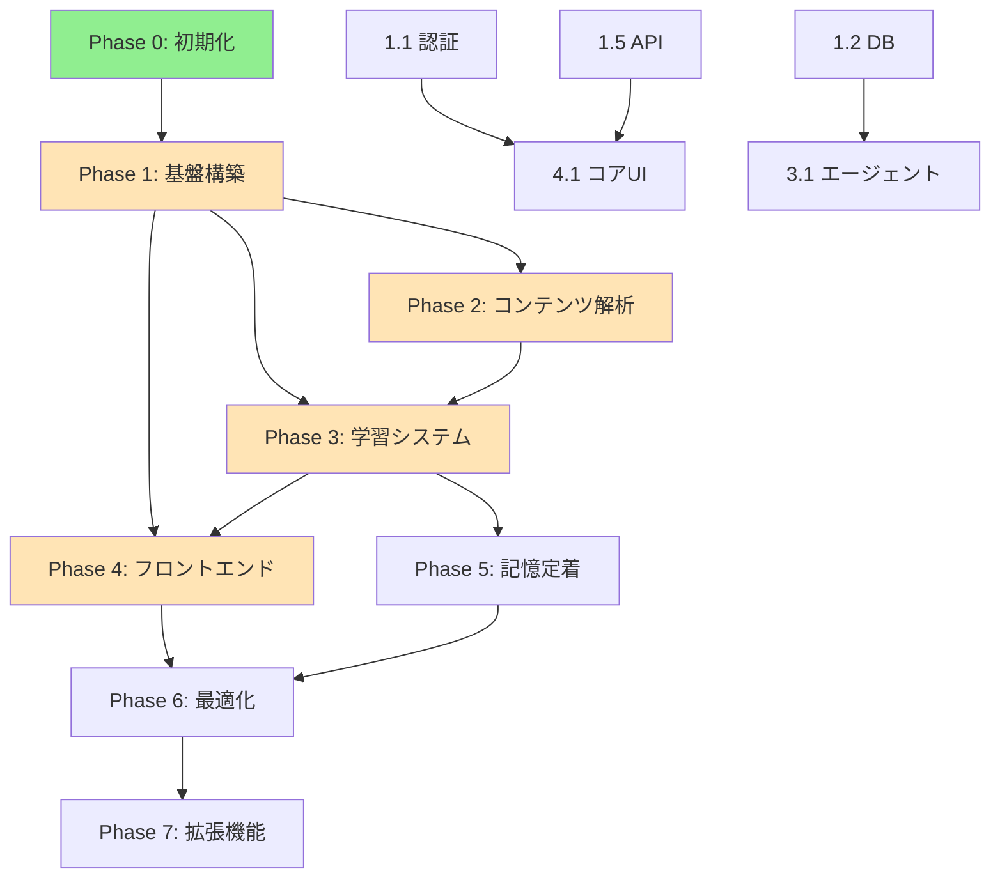

# Work Breakdown Structure (WBS)

**プロジェクト**: Learning Trainer - AIエージェント学習システム
**更新日**: 2025-11-24
**バージョン**: 1.0

---

## プロジェクト概要

| 項目 | 内容 |
|-----|------|
| **総期間** | 12-14週間 |
| **チーム数** | 5チーム（Frontend, Backend, AI Agent, DB, Infra） |
| **アプローチ** | BDD/TDD、アジャイル開発 |
| **マイルストーン** | 7つのPhase |

---

## WBS階層構造

```
Learning Trainer
│
├── Phase 0: プロジェクト初期化 (2-3日) ✅
│   ├── 0.1 環境セットアップ
│   ├── 0.2 依存関係インストール
│   └── 0.3 Git/GitHub設定
│
├── Phase 1: 基盤構築 (1.5週間)
│   ├── 1.1 認証システム
│   │   ├── 1.1.1 NextAuth.js セットアップ
│   │   ├── 1.1.2 ログイン/登録UI
│   │   └── 1.1.3 セッション管理
│   │
│   ├── 1.2 データベース
│   │   ├── 1.2.1 Prismaスキーマ定義
│   │   ├── 1.2.2 マイグレーション作成
│   │   ├── 1.2.3 pgvector拡張
│   │   └── 1.2.4 シードデータ作成
│   │
│   ├── 1.3 ユーザー設定基盤
│   │   ├── 1.3.1 UserPreferencesテーブル
│   │   ├── 1.3.2 デフォルト設定定義
│   │   ├── 1.3.3 バリデーションスキーマ
│   │   └── 1.3.4 設定マイグレーション
│   │
│   ├── 1.4 LangChain/LangGraph基盤
│   │   ├── 1.4.1 LangSmithプロジェクト作成
│   │   ├── 1.4.2 LLM呼び出しテスト
│   │   ├── 1.4.3 エージェントベースクラス
│   │   └── 1.4.4 プロンプトテンプレート管理
│   │
│   └── 1.5 API Routes
│       ├── 1.5.1 tRPCセットアップ
│       ├── 1.5.2 エラーハンドリング
│       ├── 1.5.3 バリデーション（Zod）
│       └── 1.5.4 設定API（CRUD）
│
├── Phase 2: コンテンツ解析エージェント (2週間)
│   ├── 2.1 ファイルクローラー
│   │   ├── 2.1.1 ディレクトリスキャン
│   │   ├── 2.1.2 ファイルタイプ判定
│   │   └── 2.1.3 メタデータ抽出
│   │
│   ├── 2.2 テキスト解析
│   │   ├── 2.2.1 Markdownパーサー
│   │   ├── 2.2.2 PDF解析
│   │   ├── 2.2.3 コードシンタックス解析
│   │   └── 2.2.4 LLM要約・トピック抽出
│   │
│   ├── 2.3 マルチモーダル処理
│   │   ├── 2.3.1 画像処理（GPT-4o Vision）
│   │   ├── 2.3.2 動画処理（FFmpeg + Whisper）
│   │   └── 2.3.3 埋め込み生成
│   │
│   └── 2.4 知識グラフ構築
│       ├── 2.4.1 コンテンツ関連性分析
│       ├── 2.4.2 ベクトル類似度計算
│       └── 2.4.3 依存関係グラフ構築
│
├── Phase 3: 学習システムコア (3週間)
│   ├── 3.1 学習プランニングエージェント (Week 1)
│   │   ├── 3.1.1 初回アセスメント問題生成
│   │   ├── 3.1.2 ユーザーレベル診断
│   │   ├── 3.1.3 カリキュラム生成
│   │   └── 3.1.4 難易度調整アルゴリズム
│   │
│   ├── 3.2 問題生成エージェント (Week 1)
│   │   ├── 3.2.1 選択問題生成
│   │   ├── 3.2.2 記述問題生成
│   │   ├── 3.2.3 穴埋め問題生成
│   │   ├── 3.2.4 コーディング問題生成
│   │   └── 3.2.5 Structured Output統合
│   │
│   ├── 3.3 評価エージェント (Week 2)
│   │   ├── 3.3.1 選択問題自動採点
│   │   ├── 3.3.2 記述問題AI評価
│   │   ├── 3.3.3 コード実行・テスト
│   │   └── 3.3.4 詳細フィードバック生成
│   │
│   ├── 3.4 適応的学習ロジック (Week 2)
│   │   ├── 3.4.1 正答率ベース難易度調整
│   │   ├── 3.4.2 理解度スコア計算
│   │   └── 3.4.3 次コンテンツ推薦
│   │
│   └── 3.5 LangGraph統合 (Week 3)
│       ├── 3.5.1 StateGraph設計
│       ├── 3.5.2 エージェント間ルーティング
│       ├── 3.5.3 条件分岐ロジック
│       ├── 3.5.4 チェックポイント保存
│       └── 3.5.5 ストリーミング対応
│
├── Phase 4: フロントエンド実装 (2週間)
│   ├── 4.1 コアUI (Week 1)
│   │   ├── 4.1.1 学習画面
│   │   │   ├── 4.1.1.1 ContentViewer
│   │   │   ├── 4.1.1.2 QuestionDisplay
│   │   │   ├── 4.1.1.3 AnswerInput（各タイプ）
│   │   │   └── 4.1.1.4 FeedbackPanel
│   │   │
│   │   ├── 4.1.2 shadcn/ui統合
│   │   │   ├── 4.1.2.1 基本コンポーネント
│   │   │   ├── 4.1.2.2 ダークモード
│   │   │   └── 4.1.2.3 アクセシビリティ
│   │   │
│   │   └── 4.1.3 学習モード選択UI
│   │       ├── 4.1.3.1 モード選択画面
│   │       ├── 4.1.3.2 モード説明
│   │       └── 4.1.3.3 動的UI更新
│   │
│   └── 4.2 ダッシュボード・設定 (Week 2)
│       ├── 4.2.1 プログレスダッシュボード
│       │   ├── 4.2.1.1 進捗可視化
│       │   ├── 4.2.1.2 正答率グラフ
│       │   ├── 4.2.1.3 弱点トピック表示
│       │   └── 4.2.1.4 学習時間統計
│       │
│       ├── 4.2.2 設定画面
│       │   ├── 4.2.2.1 学習形式設定UI
│       │   ├── 4.2.2.2 難易度設定UI
│       │   ├── 4.2.2.3 スケジューリング設定UI
│       │   ├── 4.2.2.4 フィードバック設定UI
│       │   ├── 4.2.2.5 ゲーミフィケーション設定UI
│       │   ├── 4.2.2.6 アクセシビリティ設定UI
│       │   └── 4.2.2.7 プリセット管理UI
│       │
│       └── 4.2.3 リアルタイム対話UI
│           ├── 4.2.3.1 WebSocket統合
│           ├── 4.2.3.2 チャット形式UI
│           └── 4.2.3.3 音声入力対応
│
├── Phase 5: 記憶定着システム (1週間)
│   ├── 5.1 間隔反復アルゴリズム
│   │   ├── 5.1.1 SuperMemo SM-2実装
│   │   ├── 5.1.2 復習スケジュール計算
│   │   └── 5.1.3 難易度係数調整
│   │
│   ├── 5.2 フラッシュカード
│   │   ├── 5.2.1 自動生成ロジック
│   │   ├── 5.2.2 めくりアニメーション
│   │   └── 5.2.3 出現頻度調整
│   │
│   └── 5.3 通知システム
│       ├── 5.3.1 復習タイミング計算
│       ├── 5.3.2 Email通知（Resend）
│       └── 5.3.3 Push通知
│
├── Phase 6: 最適化・本番化 (2週間)
│   ├── 6.1 パフォーマンス最適化 (Week 1)
│   │   ├── 6.1.1 キャッシング戦略
│   │   │   ├── 6.1.1.1 Redisセッションキャッシュ
│   │   │   ├── 6.1.1.2 プロンプトキャッシング
│   │   │   └── 6.1.1.3 React Queryキャッシュ
│   │   │
│   │   ├── 6.1.2 コスト最適化
│   │   │   ├── 6.1.2.1 LLM呼び出し最小化
│   │   │   ├── 6.1.2.2 Batch API活用
│   │   │   └── 6.1.2.3 モデル選択ロジック
│   │   │
│   │   └── 6.1.3 パフォーマンス測定
│   │       ├── 6.1.3.1 Lighthouseスコア改善
│   │       ├── 6.1.3.2 Core Web Vitals最適化
│   │       └── 6.1.3.3 画像最適化
│   │
│   └── 6.2 テスト・デプロイ (Week 2)
│       ├── 6.2.1 テスト実装
│       │   ├── 6.2.1.1 単体テスト完全化
│       │   ├── 6.2.1.2 統合テスト
│       │   └── 6.2.1.3 E2Eテスト
│       │
│       ├── 6.2.2 CI/CD
│       │   ├── 6.2.2.1 GitHub Actions設定
│       │   ├── 6.2.2.2 Vercel自動デプロイ
│       │   └── 6.2.2.3 Prismaマイグレーション自動化
│       │
│       ├── 6.2.3 セキュリティ
│       │   ├── 6.2.3.1 OWASP Top 10チェック
│       │   ├── 6.2.3.2 Rate Limiting
│       │   └── 6.2.3.3 環境変数管理
│       │
│       └── 6.2.4 ドキュメント
│           ├── 6.2.4.1 README更新
│           ├── 6.2.4.2 APIドキュメント
│           └── 6.2.4.3 ユーザーガイド
│
└── Phase 7: 拡張機能 (2-4週間) [オプション]
    ├── 7.1 ソーシャル学習
    ├── 7.2 リアルタイム音声対話
    ├── 7.3 AR学習コンテンツ
    └── 7.4 管理画面
```

---

## タスク優先度マトリクス

| Priority | Phase | タスク | 担当チーム | 重要度 | 緊急度 |
|----------|-------|-------|-----------|--------|--------|
| **P0** | 1 | Prismaスキーマ定義 | Team D | 高 | 高 |
| **P0** | 1 | 型定義作成 | All | 高 | 高 |
| **P0** | 1 | tRPCセットアップ | Team B | 高 | 高 |
| **P1** | 1 | NextAuth.js設定 | Team B | 高 | 中 |
| **P1** | 2 | コンテンツクローラー | Team C | 高 | 中 |
| **P1** | 3 | 問題生成エージェント | Team C | 高 | 中 |
| **P2** | 4 | 学習画面UI | Team A | 中 | 中 |
| **P2** | 4 | 設定画面UI | Team A | 中 | 中 |
| **P3** | 5 | 間隔反復学習 | Team C | 中 | 低 |
| **P3** | 6 | パフォーマンス最適化 | Team E | 中 | 低 |

---

## 依存関係マトリクス



---

## リソース配分

### チーム別作業量（人日）

| チーム | Phase 1 | Phase 2 | Phase 3 | Phase 4 | Phase 5 | Phase 6 | 合計 |
|--------|---------|---------|---------|---------|---------|---------|------|
| Frontend | 2 | 1 | 2 | 10 | 1 | 3 | 19 |
| Backend | 5 | 2 | 3 | 2 | 2 | 4 | 18 |
| AI Agent | 3 | 8 | 15 | 1 | 5 | 2 | 34 |
| Database | 5 | 2 | 2 | 1 | 1 | 2 | 13 |
| Infra | 1 | 1 | 1 | 1 | 1 | 10 | 15 |
| **合計** | 16 | 14 | 23 | 15 | 10 | 21 | **99** |

---

## マイルストーン

| # | マイルストーン | 期日 | 完了条件 |
|---|--------------|------|----------|
| M0 | プロジェクト初期化 | Day 3 | ✅ Gitリポジトリ、ドキュメント完成 |
| M1 | 基盤構築完了 | Week 2 | 認証、DB、API基盤動作 |
| M2 | コンテンツ解析完了 | Week 4 | output/スキャン可能 |
| M3 | 学習システムコア完了 | Week 7 | 問題生成〜評価フロー動作 |
| M4 | MVP完成 | Week 9 | 基本的な学習セッション動作 |
| M5 | 記憶定着システム完了 | Week 10 | 復習機能動作 |
| M6 | 本番リリース準備完了 | Week 12 | 全テストパス、デプロイ可能 |
| M7 | 拡張機能完了 | Week 16 | オプション機能実装 |

---

## 進捗管理ルール

### 1. タスクステータス

| ステータス | 説明 | GitHub Label |
|----------|------|-------------|
| 🔵 TODO | 未着手 | `status: todo` |
| 🟡 IN PROGRESS | 作業中 | `status: in-progress` |
| 🟢 DONE | 完了 | `status: done` |
| 🔴 BLOCKED | ブロック中 | `status: blocked` |
| ⚪ ON HOLD | 保留 | `status: on-hold` |

### 2. 更新頻度

- **日次**: 各自の作業ログ更新
- **週次**: WBS進捗更新、統合ミーティング
- **Phase完了時**: マイルストーン達成確認

### 3. 完了定義（Definition of Done）

タスクを「DONE」とするための条件:

- [ ] テストが全てパス（単体・統合）
- [ ] コードレビュー完了
- [ ] ドキュメント更新
- [ ] mainブランチにマージ
- [ ] デプロイ成功（該当する場合）

---

## ガントチャート（簡易版）

```
Week:  1    2    3    4    5    6    7    8    9   10   11   12
━━━━━━━━━━━━━━━━━━━━━━━━━━━━━━━━━━━━━━━━━━━━━━━━━━━━━━━━━━━━
Phase 0: ✅
Phase 1: [████████]
Phase 2:         [████████████]
Phase 3:                 [████████████████████]
Phase 4:                             [████████████]
Phase 5:                                     [████]
Phase 6:                                         [████████]
Phase 7:                                                 [████████████]
```

---

## 次のステップ

1. ✅ WBS作成完了
2. ⏭️ Phase別TODO詳細化（[TODO_PHASE1.md](TODO_PHASE1.md) 等）
3. ⏭️ GitHub Issues作成
4. ⏭️ 進捗トラッキングダッシュボード設定

---

**更新履歴**:
- 2025-11-24: 初版作成
